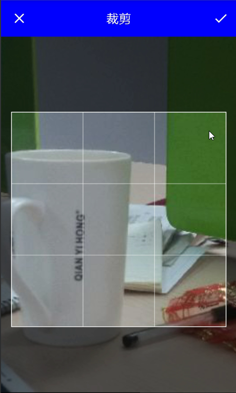
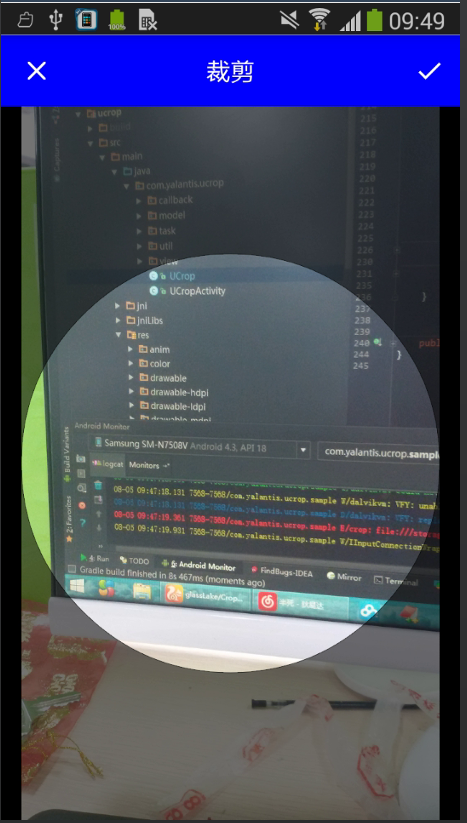

## 注: 图片选择/拍照->裁剪->压缩 整个流程的操作已经串起到下面的库中
[PhotoOut](https://github.com/hss01248/PhotoOut)


# Deprecated
此库不再维护,新库地址请看:[ https://github.com/hss01248/PicCrop](https://github.com/hss01248/PicCrop)

# CropUtils
对ucrop的封装工具类,让其使用更加快捷.

在ucrop 2.1.2(compile 'com.yalantis:ucrop:2.1.2')基础上封装,

如果以后ucrop以后升级,那么本工具类只需要改CropConfig里字段就可以.其他透明.

甚至,切换其他图片裁剪框架,也是改方法内部实现即可,不用更换各处已调用的api.


[uCrop主项目地址](https://github.com/Yalantis/uCrop)


# 效果图(标题栏和状态栏颜色均可自定义)

## 通用裁剪界面


 


## 头像裁剪框

 

# 封装的api

``` 
public static void pickFromGallery(Activity context)//

public static void pickFromCamera(Activity context)

public static void pickAvatarFromGallery(Activity context)//从图库中选头像

public static void pickAvatarFromCamera(Activity context)

public static void pickFromGallery(Activity context,CropConfig config,int type)
//需要自定义设置时使用

public static void handleResult(Activity context, CropHandler cropHandler, int requestCode, int resultCode, Intent data)

public interface CropHandler {
        void handleCropResult(Uri uri,int tag);
        void handleCropError(Intent data);
    }
```


# 使用


点击选择图片或拍照的地方调用pickxxx


实现CropHandler接口


在activity的onActivityResult里调用CropUtils.handleResult(this,cropHandler,requestCode,resultCode,data);.注意无需预先对intent做为空的判断.


tag字段用于同一个页面多个地方接收裁剪图片的区分,如无需要,不必设置.


# 相关

[本工具类介绍blog地址](http://blog.csdn.net/hss01248/article/details/52124075)

[图片加载框架Fresco的封装工具类FrescoUtils](https://github.com/glassLake/FrescoUtlis)
